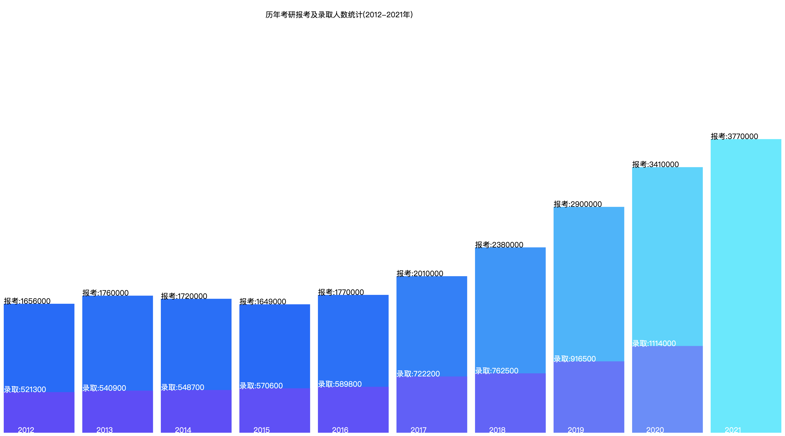
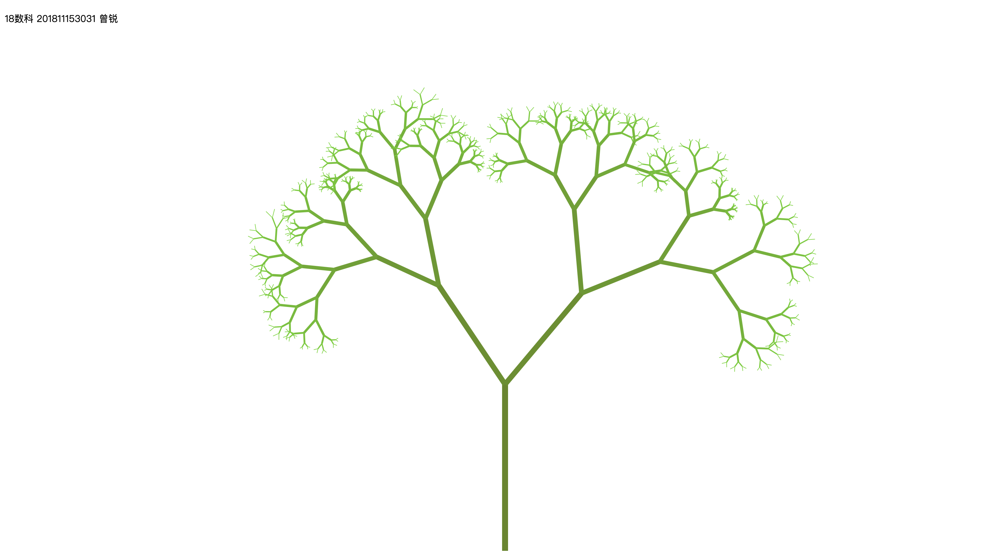
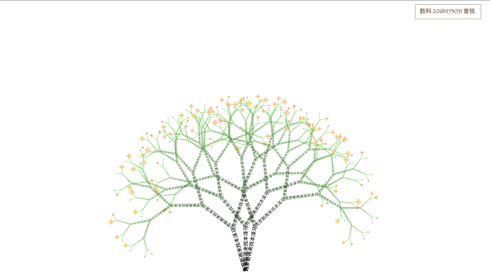
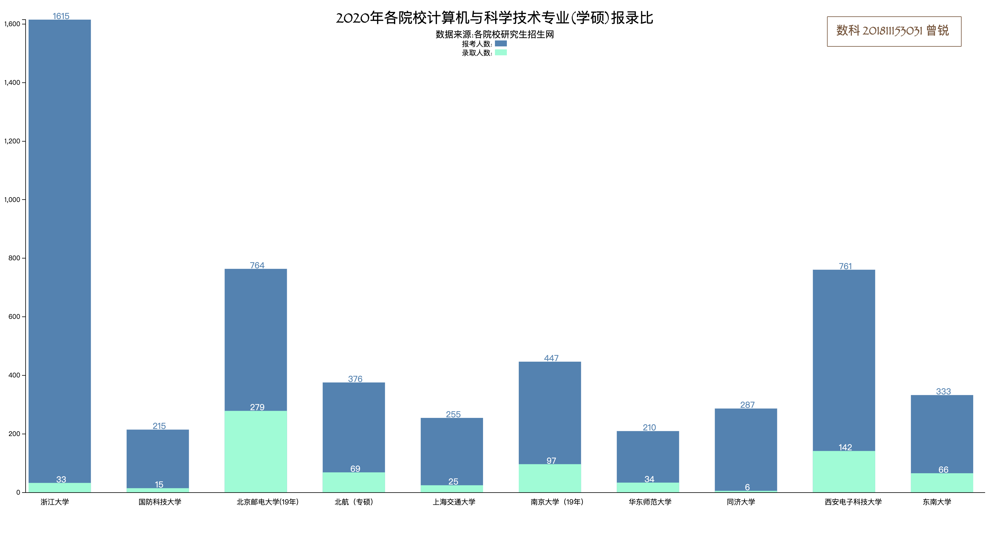
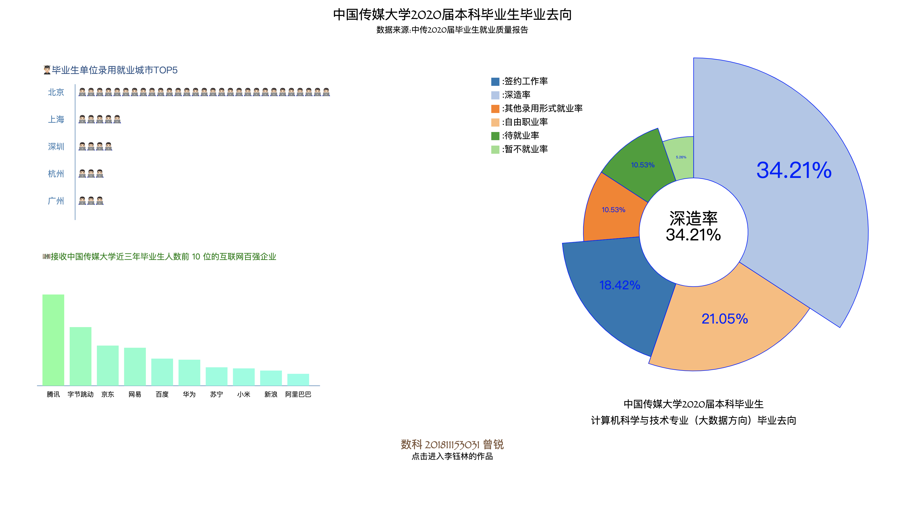
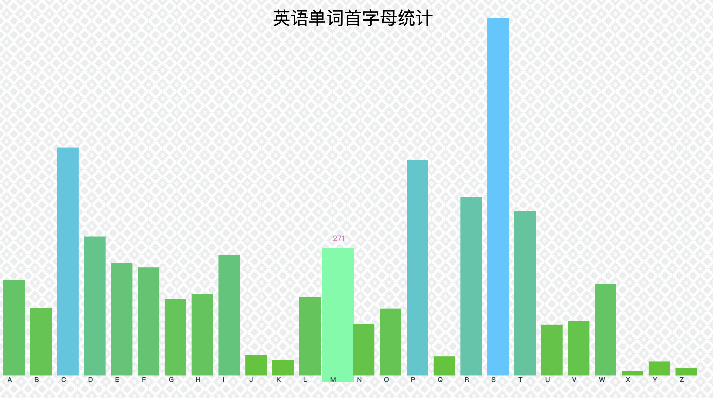
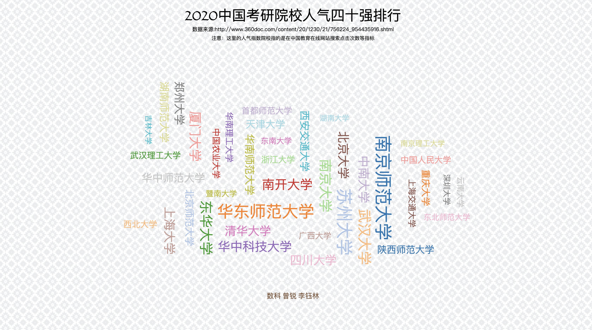

# 2021数据可视化学习
> 近年来，可视化越来越流行，许多报刊杂志、门户网站、新闻媒体都大量使用可视化技术，使得复杂的数据和文字变得十分容易理解。而 D3 正是数据可视化工具中的佼佼者，基于 JavaScript 开发，项目托管于 GitHub。从 D3 诞生以来，不断受到好评，在 GitHub 上的项目仓库排 行榜也不断上升。本项目的目的在于提供一个简单易懂的入门教程，希望读者能够喜欢。

[代码仓库](https://github.com/Soulmate7/DataVisualization)

---
## 简介与安装

D3 的全称是（Data-Driven Documents），顾名思义可以知道是一个被数据驱动的文档。听名字有点抽 象，说简单一点，其实就是一个 JavaScript 的函数库，使用它主要是用来做数据可视化的。

JavaScript 文件的后缀名通常为 .js，故 D3 也常使用 D3.js 称呼。D3 提供了各种简单易用的函数，大大简化了 JavaScript 操作数据的难度。由于它本质上是 JavaScript ，所以用 JavaScript 也是可以实现所有功能的，但它能大大减小你的工作量，尤其是在数据可视化方面，D3 已经将生成可视化的复杂步骤精简到了几个简单的函数，你只需要输入几个简单的数据，就能够转换为各种绚丽的图形。

- 安装
[官方网站](http://d3js.org/)下载d3.zip，解压后，在 HTML 文件中包含相关的 js 文件即可。
或者直接在代码中引用链接`<script src="http://d3js.org/d3.v3.min.js" charset="utf-8"></script>`但要保持网络通畅。

准备好工具后，我们就可以开始D3可视化之旅了。

---
## JS绘制直方图
在学习D3之前，我们先来看一下如何用JavaScript来绘制直方图
- 基本语法

[JavaScript基本语法](https://www.runoob.com/js/js-syntax.html)

语法基本与我们学的编程语言无二异，注意变量声明的细小区别
元素内部文本，包括HTML标签:`innerHTML`
元素内部文本，不包括HTML标签:`innerText`
添加节点:`appendChild()`

- svg图形

矩形`<rect x=“20” y=“20” width=“200” height=“300” />`
`<rect x=“20” y=“20” rx=“20” ry=“30” width=“200” height=“300” `
`style=“fill:yellow;stroke:black; stroke-width:4;opacity:0.5” />`
圆形`<circle cx=“150” cy=“150” r=“80” />`
椭圆`<ellipse cx=“350” cy=“150” rx=“110” ry=“80” />`
线段`<line x1=“20” y1=“20” x2=“300” y2=“100” />`

- 获取屏幕分辨率&浏览器可用宽度
``` JavaScript
<script>
var w=window.innerWidth
|| document.documentElement.clientWidth
|| document.body.clientWidth;

var h=window.innerHeight
|| document.documentElement.clientHeight
|| document.body.clientHeight;

x=document.getElementById("demo");
x.innerHTML="浏览器的内部窗口宽度：" + w + "，高度：" + h + "。"
</script>
```

- code

现在我们来绘制直方图
``` javascript
<html>
    <head>
        <title>JavaScript直方图</title>
        <meta charset="utf-8">
    </head>
    <body>
        <svg id='mysvg'>
        </svg>
        <script>
            var w=window.innerWidth || document.documentElement.clientWidth || document.body.clientWidth;
            var h=window.innerHeight || document.documentElement.clientHeight || document.body.clientHeight;
            var svg=document.getElementById("mysvg");
            svg.setAttribute('width',w);
            svg.setAttribute('height',h);
            var title=document.createElement("text");
            svg.appendChild(title);
            title.outerHTML="<text  x="+w/3+" y=50>历年考研报考及录取人数统计(2012-2021年)</text>"
            var nums_sign=[1656000,1760000,1720000,1649000,1770000,2010000,2380000,2900000,3410000,3770000];
            var nums_admit=[521300,540900,548700,570600,589800,722200,762500,916500,1114000];
            var years=["2012","2013","2014","2015","2016","2017","2018","2019","2020","2021"];
            var rec=new Array(10);
            var rec2=new Array(10);
            var txt=new Array(10);
            var txt2=new Array(10);
            var txt3=new Array(10);
            for(var i=0;i<10;i++)
            {
                rec[i]=document.createElement("rect");
                svg.appendChild(rec[i]);
                txt[i]=document.createElement("text");
                svg.appendChild(txt[i]);
                var height=nums_sign[i]/6000;
                rec[i].outerHTML="<rect x="+(i*w/rec.length)+" y="+(h-height)+" width="+(0.9*w/rec.length)+" height="+height+" fill='rgb(0,"+nums_sign[i]/16000+",255)'>";
                txt[i].outerHTML="<text x="+(i*w/rec.length)+" y="+(h-height)+">"+"报考:"+nums_sign[i]+"</text>"

                rec2[i]=document.createElement("rect");
                svg.appendChild(rec2[i]);
                txt2[i]=document.createElement("text");
                svg.appendChild(txt2[i]);
                height=nums_admit[i]/6000;
                rec2[i].outerHTML="<rect x="+(i*w/rec.length)+" y="+(h-height)+" width="+(0.9*w/rec.length)+" height="+height+" fill='rgb(100,"+nums_admit[i]/8000+",255)'>";
                txt2[i].outerHTML="<text x="+(i*w/rec.length)+" y="+(h-height)+" fill='white'>"+"录取:"+nums_admit[i]+"</text>"
                
                txt3[i]=document.createElement("text");
                svg.appendChild(txt3[i]);
                txt3[i].outerHTML="<text x="+(i*w/rec.length+30)+" y="+h+" fill='white'>"+years[i]+"</text>";

            }
        </script>
    </body>
</html>
```

- 效果展示


[点击查看](http://47.93.252.206:8080/div2021/Histogram.html)

- 二叉树


[点击查看](http://47.93.252.206:8080/div2021/BinaryTree.html)

- 文字二叉树


[点击查看](http://47.93.252.206:8080/div2021/WordTree.html)


---

## 基于D3的直方图绘制

在绘制直方图之前，我们先学一下 D3 的方法

- 选择元素
`d3.select()`是选择所有指定元素的第一个
`d3.selectAll()`：是选择指定元素的全部
这两个函数返回的结果称为选择集。

- 绑定数据
`datum()`绑定一个数据到选择集上

- 选择、插入、删除元素

选择
`var p2 = body.select("#myid"); p2.style("color","red");`选择元素

插入:
`body.append("p").text("append p element");`
`body.insert("p","#myid").text("insert p element");`

删除:
`var p = body.select("#myid"); p.remove();`

D3绘制直方图code
``` javascript
<html>
    <head>
        <title>ZR's histogram by d3</title>
        <meta charset="utf-8">
        <style>
          .axis path,
          .axis line{
              fill: none;
              stroke: black;
              shape-rendering: crispEdges;
          }
           
          .axis text {
              font-family: sans-serif;
              font-size: 11px;
          }
          </style>
    </head>
    <body>
        <script src="https://d3js.org/d3.v3.min.js" charset="utf-8"></script>
        <!--script src="d3.v3.min.js" charset="utf-8"></script-->
        <script>
            var w=window.innerWidth || document.documentElement.clientWidth || document.body.clientWidth;
            var h=window.innerHeight || document.documentElement.clientHeight || document.body.clientHeight;
            w=w*0.98;
            h=h*0.9;
            var svg=d3.select("body")
            .append("svg")
            .attr("width",w)
            .attr("height",h);
            svg.append("text")
            .attr("font-size","20px")
            .attr("fill","rgb(124,84,57)")
            .attr("font-family","Fantasy")
            .attr("x",w-250)
            .attr("y",50)
            .text("数科 201811153031 曾锐");
            var line1=svg.append("line").attr("x1",w-265).attr("y1",20).attr("x2",w-40).attr("y2",20).attr("stroke","rgb(124,84,57)");
            var line2=svg.append("line").attr("x1",w-265).attr("y1",70).attr("x2",w-40).attr("y2",70).attr("stroke","rgb(124,84,57)");
            var line3=svg.append("line").attr("x1",w-265).attr("y1",20).attr("x2",w-265).attr("y2",70).attr("stroke","rgb(124,84,57)");
            var line4=svg.append("line").attr("x1",w-40).attr("y1",20).attr("x2",w-40).attr("y2",70).attr("stroke","rgb(124,84,57)");
            svg.append("text")
            .attr("font-size","24px")
            .attr("font-family","Fantasy")
            .attr("text-anchor","middle")
            .attr("x",w/2)
            .attr("y",30)
            .text("2020年各院校计算机与科学技术专业(学硕)报录比");
            svg.append("text")
            .attr("font-size","15px")
            .attr("font-family","Fantasy")
            .attr("text-anchor","middle")
            .attr("x",w/2)
            .attr("y",55)
            .text("数据来源:各院校研究生招生网");
            svg.append("text")
            .attr("font-size","12px")
            .attr("font-family","Fantasy")
            .attr("text-anchor","middle")
            .attr("x",w/2-30)
            .attr("y",70)
            .text("报考人数:");
            svg.append("rect")
            .attr("x",w/2)
            .attr("y",60)
            .attr("height",10)
            .attr("width",20)
            .attr("fill","steelblue");
            svg.append("text")
            .attr("font-size","12px")
            .attr("font-family","Fantasy")
            .attr("text-anchor","middle")
            .attr("x",w/2-30)
            .attr("y",85)
            .text("录取人数:");
            svg.append("rect")
            .attr("x",w/2)
            .attr("y",75)
            .attr("height",10)
            .attr("width",20)
            .attr("fill","rgb(127,255,212)");
            svg.append("rec")
            .attr()
            var colleges=["浙江大学","国防科技大学","北京邮电大学(19年)","北航（专硕）","上海交通大学","南京大学（19年）","华东师范大学","同济大学","西安电子科技大学","东南大学"];
            var dataset=[1615,215,764,376,255,447,210,287,761,333];
            var dataset2=[33,15,279,69,25,97,34,6,142,66];
            var college=svg.selectAll(".college")
            .data(colleges)
            .enter()
            .append("text")
            .attr("font-size","12px")
            .attr("x",function(d,i){
              return i*(w/colleges.length)+60;
            })
            .attr("y",h-5)
            .text(function(d){
              return d;
            });

            var linear=d3.scale.linear()
            .domain([0,d3.max(dataset)])
            .range([0,h-50]);

            svg.selectAll(".rect")
            .data(dataset)
            .enter()
            .append("rect")
            .attr("x",function(d,i){
              return i*(w/dataset.length)+40;
            })
            .attr("y",function(d){
              return h-linear(d)-25;
            })
            .attr("width",(w/dataset.length)-60)
            .attr("height",function(d){
              return linear(d);
            })
            .attr("fill","steelblue")

            svg.selectAll("data")
            .data(dataset2)
            .enter()
            .append("rect")
            .attr("x",function(d,i){
              return i*(w/dataset2.length)+40;
            })
            .attr("y",function(d){
              return h-linear(d)-25;
            })
            .attr("width",(w/dataset2.length)-60)
            .attr("height",function(d){
              return linear(d);
            })
            .attr("fill","rgb(127,255,212)");  
            
            svg.selectAll(".textvalue")
            .data(dataset)
            .enter()
            .append("text")
            .attr("fill","steelblue")
            .attr("font-size","14px")
            .attr("text-anchor","middle")
            .attr("x",function(d,i){
              return i*(w/dataset.length)+30;
            })
            .attr("y",function(d){
              return h-linear(d)-40;
            })
            .attr("dx",((w/dataset.length)-35)/2)
            .attr("dy","1em")
            .text(function(d){
              return d;
            });
            svg.selectAll(".textvalue2")
            .data(dataset2)
            .enter()
            .append("text")
            .attr("fill","white")
            .attr("font-size","14px")
            .attr("text-anchor","middle")
            .attr("x",function(d,i){
              return i*(w/dataset2.length)+30;
            })
            .attr("y",function(d){
              return h-linear(d)-40;
            })
            .attr("dx",((w/dataset2.length)-35)/2)
            .attr("dy","1em")
            .text(function(d){
              return d;
            });
            

            var yScale = d3.scale.linear()
            .domain([0,d3.max(dataset)])
            .range([0,-h+50]);          
            var yAxis=d3.svg.axis()
            .scale(yScale)
            .orient("left");

            svg.append("line")
            .attr("x1",35)
            .attr("y1",h-25)
            .attr("x2",w)
            .attr("y2",h-25)
            .attr("stroke", "black");
            svg.append("g")
            .attr("class","axis")
            .attr("transform","translate("+35+","+(h-25)+")")
            .call(yAxis);
            
            
        </script>
    </body>
</html>
```

- 效果展示


[点击查看](http://47.93.252.206:8080/div2021/HistogramByD3.html)

---

## 环图

- 布局

`layout`
D3的特点是先布局，后绘制 

- 路径

SVG中<path> 标签用来定义路径
``` html
<svg width="100%" height="100%" version="1.1"
xmlns="http://www.w3.org/2000/svg">

<path d="M250 150 L150 350 L350 350 Z" />

</svg>
```

- 圆弧绘制

``` javascript
var dataset = { startAngle: 0 , endAngle: Math.PI * 0.75 };
//创建一个弧生成器
var arcPath = d3.svg.arc()
				.innerRadius(50)
				.outerRadius(100);

//添加路径
svg.append("path")
	.attr("d",arcPath(dataset))	
	.attr("transform","translate(250,250)")
	.attr("stroke","black")
	.attr("stroke-width","3px")
	.attr("fill","yellow");
```

- 饼图添加文字

``` javascript
svg.selectAll("text")
	.data(dataset)
	.enter()
	.append("text")
	.attr("transform",function(d){
		return "translate(250,250)" + 
				"translate(" + arcPath.centroid(d) + ")";
	})
	.attr("text-anchor","middle")
	.attr("fill","white")
	.attr("font-size","18px")
	.text(function(d){ return Math.floor((d.endAngle - d.startAngle)*180/Math.PI) + "°"; });
```

- 动画

**transition()**
启动过渡效果。 其前后是图形变化前后的状态（形状、位置、颜色等等），例如：

**duration()**
指定过渡的持续时间，单位为毫秒。

**ease()**
指定过渡的方式，常用的有：

- linear：普通的线性变化

- circle：慢慢地到达变换的最终状态

- elastic：带有弹跳的到达最终状态

- bounce：在最终状态处弹跳几次

**delay()**
指定延迟的时间，表示一定时间后才开始转变，单位同样为毫秒。此函数可以对整体指定延迟，也可以对个别指定延迟。

- 交互

**鼠标移入**
``` javascript
.on("mouseover",function(d,i){						
    d3.select(this)
		.attr("fill","#E87A90");
	                    })
```

**移出后复原**
``` javascript
 .on("mouseout",function(d,i){
			 d3.select(this)
		                .transition()
                	                .duration(500)
                                      .attr("fill",color(i));
});
```

- 效果展示



[点击查看](http://47.93.252.206:8080/div2021/pie.html)


---

## JSP链接数据库并可视化

- 准备
将mysql-connector-java-8.0.19.jar包放入tomcat的lib目录下
并且记得**重启**tomcat！

- 加载驱动程序
`String driverName="com.mysql.jdbc.Driver";`

- 数据库
`String dbName="engword";`

- 数据表
`String tableName="map_enword";`

- 用户名密码
``` javascript
String userName="root";
String userPasswd="2021";
```

- 建立连接
``` javascript
Class.forName(driverName).newInstance();
Connection connection=DriverManager.getConnection(url);
```

- 陈述&得到回答
``` javascript
Statement statement=connection.createStatement();
String sql="Select * from "+tableName+" order by english";
ResultSet rs=statement.executeQuery(sql);
int count=0;
		while(rs.next())
		{
			count++;
			if (count<10) 
				out.print(rs.getString(2)+"<br>");
		}
		out.print(count);  
		out.print("<br>");
```

- 关闭连接
``` javascript
rs.close();                                              //数据取完
statement.close();                           //陈述结束
connection.close();                          //断开链接
```

- 效果展示



[点击查看](http://47.93.252.206:8080/div2021/indexHist.jsp)


---
## 力导向图 

- code

``` javascript
<html>
    <head>
        <title>人民的名义人物关系ByZR</title>
        <meta charset="utf-8">
    </head>
    <body>
        <script src="d3.v3.min.js" charset="utf-8"></script>
        <script>
            var w=window.innerWidth || document.documentElement.clientWidth || document.body.clientWidth;
            var h=window.innerHeight || document.documentElement.clientHeight || document.body.clientHeight;
            w=w*0.98;
            h=h*0.9;
            var svg=d3.select("body")
                      .append("svg")
                      .attr("width",w)
                      .attr("height",h);
               var nodes=[{name:"侯亮平",image:"hlp.jpg",intro:"——侯亮平是最高检反贪局侦查处处长，汉东省人民检察院副检察长兼反贪局局长。经过与腐败违法分子的斗争，最终将一批腐败分子送上了审判台，正义战胜邪恶，自己也迎来了成长。"},
				{name:"高育良",image:"gyl.jpg",intro:"——高育良是汉东省省委副书记兼政法委书记。年近六十，是一个擅长太极功夫的官场老手。侯亮平、陈海和祁同伟都是其学生。"},
				{name:"祁同伟",image:"qtw.jpg",intro:"——祈同伟是汉东省公安厅厅长。出身农民，曾想凭自己的努力走上去，内心渴望成为一个胜天半子的人，但现实却沉重地打击了他，进而走上了不归路"},
				{name:"陈海",image:"ch.jpg",intro:"——陈海是汉东省人民检察院反贪局局长。他不畏强权、裁决果断，一出场就与汉东官场权利正面交锋；他廉明正直、重情重义，与好兄弟侯亮平携手战斗在反腐第一线，他遭遇暗害惨出车祸而躺在医院。"},
				{name:"蔡成功",image:"ccg.jpg",intro:"——蔡成功是汉东省大风厂董事长、法人代表，为人狡诈，为了招标成功而贿赂政府官员，甚至连发小反贪局局长侯亮平也企图想去贿赂。"},
				{name:"高小琴",image:"gxq.jpg",intro:"——高小琴是山水集团董事长，也是一位叱咤于政界和商界的风云人物，处事圆滑、精明干练。在与官员沟通时更是辩口利辞，沉稳大气，拥有高智商和高情商，并得到以“猴精”著称的反贪局长侯亮平冠以“美女蛇”的称号。"},
	            {name:"高小凤",image:"gxf.jpg",intro:"——高小凤是高小琴的孪生妹妹，高育良的情妇。"},
				{name:"陆亦可",image:"lyk.jpg",intro:"——陆亦可是汉东省检察院反贪局的女检查官，表面冷峻决绝，内心重情重义。大龄未嫁的她面临着家庭逼婚的困境，而她抗婚是因为对反贪局长陈海一往情深。然而陈海惨遭横祸，她收起悲愤去探求真相拨云见雾，同时在公安局长赵东来的追求中获得真爱。"},
				{name:"赵东来",image:"zdl.jpg",intro:"——赵东来是汉东省京州市公安局局长。看似直来直去，但却深谋远虑，智勇双全。为了保护正义的尊严，报着坚决整治恶势力的决心，在与检察部门的合作中从最初的质疑到之后的通力配合，展现出现代执法机构的反腐决心。"},
				{name:"陈岩石",image:"cys.jpg",intro:"——陈岩石是离休干部、汉东省检察院前常务副检察长。充满正义，平凡而普通的共产党人。对大老虎赵立春，以各种形式执着举报了十二年。在这场关系党和国家生死存亡的斗争中，老人家以耄耋高龄，义无反顾"},
				{name:"李达康",image:"ldk.jpg",intro:"——李达康是汉东省省委常委，京州市市委书记，是一个正义无私的好官。但为人过于爱惜自己的羽毛，对待身边的亲人和朋友显得过于无情"},
				{name:"沙瑞金",image:"srj.jpg",intro:"——沙瑞金是汉东省省委书记。刚至汉东便发生丁义珍出逃美国事件，又遇到大风厂案。深知汉东政治情况的沙瑞金支持侯亮平查案，要求他上不封顶。"},
				{name:"欧阳菁",image:"oyj.jpg",intro:"——欧阳菁是汉东省京州市城市银行副行长，京州市市委书记李达康的妻子，后因感情不和离婚。她曾利用职务的便利贪赃枉法。"},
				{name:"丁义珍",image:"dyz.jpg",intro:"——丁义珍英文名汤姆丁。汉东省京州市副市长兼光明区区委书记。贪污腐败，逃往国外。"},
				{name:"季昌明",image:"jcm.jpg",intro:"——季昌明是汉东省省级检察院检察长。清廉负责，为人正直，性格温和，但也有些拘泥于教条。对初到汉东省的侯亮平提供了极大地帮助，为破解案件起到了极大地作用。"},
				{name:"钟小艾",image:"zxa.jpg",intro:"——钟小艾是侯亮平的妻子，中纪委调查组的委派员。"},
				{name:"赵瑞龙",image:"zrl.jpg",intro:"——赵瑞龙是副国级人物赵立春的公子哥，官二代，打着老子的旗子，黑白两道通吃，权倾一时。把汉东省搅得天翻地覆。"}];
		var edges=[{source:0,target:1,relation:"师生"},{source:0,target:2,relation:"同门"},{source:0,target:3,relation:"同学&挚友"},
	           {source:0,target:4,relation:"发小"},{source:0,target:7,relation:"同事"}, {source:0,target:15,relation:"夫妻"}, 
			   {source:14,target:0,relation:"上下级"},{source:1,target:2,relation:"师生"},{source:1,target:3,relation:"师生"}, 
			   {source:1,target:6,relation:"情人"}, {source:1,target:11,relation:"上下级"},{source:1,target:10,relation:"政敌"},
			   {source:2,target:5,relation:"情人"}, {source:2,target:3,relation:"同门&陷害"},  {source:2,target:11,relation:"上下级"},
			   {source:3,target:9,relation:"父子"},{source:4,target:5,relation:"商业对手"},{source:5,target:6,relation:"孪生姐妹"}, 
			   {source:8,target:11,relation:"上下级"},{source:9,target:11,relation:"故交"},
			   {source:10,target:11,relation:"上下级"},{source:10,target:12,relation:"夫妻"},{source:13,target:10,relation:"上下级"},
			   {source:12,target:4,relation:"受贿关系"},{source:16,target:2,relation:"利益关系"},{source:16,target:5,relation:"利益关系"}];
               
            
            var color=d3.scale.category20();

            var force=d3.layout.force()
                               .charge(-120)
                               .linkDistance(500)
                               .size([w,h]);

            var tooltip=d3.selectAll("body")
                          .append("div")
                          .attr("class","tooltip")
                          .style("opacity",0.0);

                force.nodes(nodes)
                     .links(edges)
                     .start();
                var link=svg.selectAll(".link")
                            .data(edges)
                            .enter()
                            .append("line")
                            .attr("class","link")
                            .style("stroke-width",1)
                            .style("opacity",0.4)
                            .style("stroke","gray");

                var node=svg.selectAll(".node")
                            .data(nodes)
                            .enter()
                            .append("circle")
                            .attr("class","node")
                            .attr("r",function(d){return d.weight*3;})
                            .attr("cx",100)
                            .attr("cy",100)
                            .style("fill",function(d,i){
                                //return "rgb(100,200,"+(10*i)+")";
                                return color(i);
                            })
                            .call(force.drag);
                
                var edgetext=svg.selectAll(".linetext")
                                .data(edges)
                                .enter()
                                .append("text")
                                .attr("class","linetext")
                                .style("stroke","gray")
                                .style("font-size",8)
                                .text(function(d){return d.relation;});
                var img_h=50;
		        var img_w=50;
		        var radius=23;
                var circles=svg.selectAll("forceCircle")
                                .data(nodes)
                                .enter()
                                .append("circle")
                                .attr("class","forceCircle")
                                .attr("r",radius)
                                .style("stroke","DarkGray")
                                .style("stroke-width","1px")
                                .attr("fill",function(d,i){
                                    var defs=svg.append("defs")
                                                .attr("id","imgdefs");
                                    var catpattern=defs.append("pattern")
                                                        .attr("id","catpattern"+i)
                                                        .attr("height",1)
                                                        .attr("width",1);
                                    catpattern.append("image")
                                              .attr("x",-(img_w/2-radius+5.8))
                                              .attr("y",-(img_h/2-radius+3.5))
                                              .attr("width",img_w+11)
                                              .attr("height",img_h+6)
                                              .attr("xlink:href","image/"+d.image);
                                    return "url(#catpattern"+i+")";
                                })
                                .on("mouseover",function(d,i){
                                    tooltip.html("角色简介"+d.intro)
                                           .style("left",(d3.event.pageX)+"px")
                                           .style("top",(d3.event.pageY+20)+"px")
                                           .style("opacity",1.0);
                                })
                                .call(force.drag);

                var text=svg.selectAll(".forcetxt")
                            .data(nodes)
                            .enter()
                            .append("text")
                            .attr("class","forcetxt")
                            .attr("text-anchor","middle")
                            .attr("x",100)
                            .attr("y",200)
                            .style("stroke", "#336666") 
                            .style("font-size","10px") 
                            .attr("dx","0em") 
                            .attr("dy","3em") 
                            .text(function(d){return d.name;});

                force.on("tick",function(){
                
                    link.attr("x1",function(d){return d.source.x;})
                        .attr("y1",function(d){return d.source.y;})
                        .attr("x2",function(d){return d.target.x;})
                        .attr("y2",function(d){return d.target.y;});

                    node.attr("cx",function(d){return d.x;})
                        .attr("cy",function(d){return d.y;});

                    text.attr("x",function(d){return d.x;})
                        .attr("y",function(d){return d.y;});

                    edgetext.attr("x",function(d){return (d.source.x+d.target.x)/2;})
                            .attr("y",function(d){return (d.source.y+d.target.y)/2;});

                    circles.attr("cx",function(d){return d.x;})
                           .attr("cy",function(d){return d.y;});
            });
            


        </script>
    </body>
</html>
```
- 效果展示


[点击查看](http://47.93.252.206:8080/div2021/forcePeople.html)


---
## 基于D3的词云图可视化
### 简介
> 词云图（Word Cloud）是一种富信息文本可视化技术，通过布局算法用文字大小表 示词频，辅以多种色彩显示，直观反映词组重要性差异，展示文本关键摘要信息。
近年来，词云图作为极富表现力的可视化载体，广泛应用于网站导航、社会化标签呈现、 Web 文本分析以及各种文本挖掘和可视化场景。 

完整的词云分析包括有：
- 分词
- 词频统计
- 可视化

D3.JS词云图实现了JavaScript的Wordle算法。Wordle基于空间四叉树去除重叠。
**加载的JavaScript库**：[d3.layout.cloud.js](https://github.com/jasondavies/d3-cloud)

- code

``` javascript
<html>
    <head>
        <title>2020中国考研院校人气四十强排行</title>
        <meta charset="utf-8">
    </head>

    <body>
        <body background="image/moroccan-flower.png"></body>
        <script src="http://d3js.org/d3.v3.min.js" charset="utf-8"></script>
        <script src="d3.layout.cloud.js"></script>
        <script>
            var w=window.innerWidth || document.documentElement.clientWidth || document.body.clientWidth;
            var h=window.innerHeight || document.documentElement.clientHeight || document.body.clientHeight;
            w=w*0.98;
            h=h*0.9;
		 var fill = d3.scale.category20();
		 var words=[{text:"南京师范大学",size:50.51740},{text:"苏州大学",size:48.23926},{text:"华东师范大学",size:46.03547},{text:"武汉大学",size:40.64378},
{text:"东华大学",size:39.96762},{text:"南京大学",size:38.87550},{text:"南开大学",size:36.49173},{text:"厦门大学",size:36.24342},
{text:"华中科技大学",size:35.45926},{text:"中南大学",size:34.77292},{text:"北京大学",size:34.25036},{text:"上海大学",size:34.19091},
      {text:"清华大学",size:33.52113},{text:"四川大学",size:33.05628},{text:"郑州大学",size:31.93532},{text:"华中师范大学",size:30.57024},
      {text:"华南师范大学",size:29.92051},{text:"湖南师范大学",size:29.69627},{text:"西安交通大学",size:29.57067},{text:"天津大学",size:28.48719},
      {text:"陕西师范大学",size:27.80969},{text:"北京师范大学",size:27.67637},{text:"重庆大学",size:26.22049},{text:"西北大学",size:24.88220},
      {text:"武汉理工大学",size:24.87279},{text:"浙江大学",size:24.77883},{text:"中国农业大学",size:24.77855},{text:"中国人民大学",size:24.30072},
      {text:"华南理工大学",size:24.27717},{text:"首都师范大学",size:24.16071},{text:"上海交通大学",size:23.74146},{text:"广西大学",size:23.47454},
      {text:"东南大学",size:22.81777},{text:"东北师范大学",size:22.65131},{text:"深圳大学",size:22.56683},{text:"云南大学",size:22.40241},
      {text:"暨南大学",size:22.21407},{text:"南京理工大学",size:21.91337},{text:"吉林大学",size:21.85239},{text:"湖南大学",size:21.54555}];
		 var wc=d3.layout.cloud()
				  .size([w, h])
				  .words(words)
				  .padding(5)
				  .rotate(function() { return ~~(Math.random() * 2) * 90; })
				  .font("Impact")
				  .fontSize(function(d) { return d.size; })
				  .on("end", draw)
				  .start();

		  function draw(words) {
         var svg=d3.select("body")
            .append("svg")
            .attr("width",w)
            .attr("height",h);
        //console.log(h)
		  	 svg.append("text")
            .attr("font-size","40px")
            .attr("font-family","Fantasy")
            .attr("text-anchor","middle")
            .attr("x",w/2)
            .attr("y",h/17)
            .text("2020中国考研院校人气四十强排行");
         svg.append("text")
            .attr("font-size","15px")
            .attr("text-anchor","middle")
            .attr("x",w/2)
            .attr("y",h/10.5)
            .text("数据来源:http://www.360doc.com/content/20/1230/21/756224_954435916.shtml");
         svg.append("text")
            .attr("font-size","14px")
            .attr("text-anchor","middle")
            .attr("x",w/2)
            .attr("y",h/8)
            .text("注意：这里的人气指数院校指的是在中国教育在线网站搜索点击次数等指标");

			svg.attr("width", w)
				.attr("height", h)
			  .append("g")
				.attr("transform", "translate(800,500)")
			  .selectAll("text")
				.data(words)
			  .enter().append("text")
				.style("font-size", function(d) { return d.size + "px"; })
				.style("font-family", "Impact")
				.style("fill", function(d, i) { return fill(i); })
				.attr("text-anchor", "middle")
				.attr("transform", function(d) {
				  return "translate(" + [d.x, d.y] + ")rotate(" + d.rotate + ")";
				})
				.text(function(d) { return d.text; });

                svg.append("text")
               .attr("font-size","20px")
               .attr("fill","rgb(124,84,57)")
               .attr("font-family","Fantasy")
               .attr("text-anchor","middle")
               .attr("x",w/2)
               .attr("y",h-5)
               .text("数科 曾锐 李钰林");
		  }
          
          
        </script>
    </body>
</html>
```

- 效果展示


[点击查看](http://47.93.252.206:8080/div2021/Cloud.html)

---
### 参考资料
[数据可视化慕课](https://www.icourse163.org/spoc/learn/CUC-1462488181?tid=1463302467#/learn/announce)
[W3school](https://www.w3school.com.cn/index.html)
[OUR D3.JS 数据可视化专题站](http://www.ourd3js.com/)
[How the Word Cloud Generator Works](https://www.jasondavies.com/wordcloud/about/)
